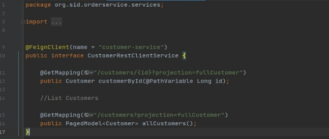

**Ecole Normale Supérieure de l’Enseignement Technique Mohammedia**

**Université Hassan II de Casablanca**

ﺍ ﻟﻤﺪﺭﺳﺔﺍﻟﻌﻠﻴﺎﻸﺳﺎﺗﺬﺓﺍﻟﺘﻌﻠﻴﻢﺍﻟﺘﻘﻨﻲالمحمدية ﺟﺎﻣﻌﺔﺍﻟﺤﺴﻦﺍﻟﺜﺎﻧﻲﺑﺎﻟﺪﺍﺭﺍﻟﺒﻴﻀﺎﺀ

# **Architectures Micro services avec (Spring Cloud Config, Consul Discovery, Consul Config,Vault)**

**Travail à faire**

Création d’une application de e-commerce basée sur les micro services:

Consul Discovery Spring Cloud Config Spring Cloud Gateway Customer-service Inventory Service Order Service

Consul Config (Billing Service) Vault (Billing Service) Frontend Web avec Angular

17

# **PARTIE 1 : Configuration des microservices**

1. **Démarrer le service Consul Discovery.**
1. **Activer le service de configuration des microservices:**

1. **Création d’un dossier contient les fichiers de configuration des ms :**

1. **Configuration partagée par les microservices :**

1. **Exemple de configuration (Customer-service) :**

1. **Configuration de service de configuration crée :**

On va stocker la configuration de l'ensemble de microservices dans (repository git en local), Quand le service de configuration démarre va chercher dans le repository où se trouve la configuration de l'ensemble de microservices.

1. **Démarrer le service de configuration :**

# **PARTIE 2 : Création de Gateway**

1. **Configuration automatique de Gateway :**

1. **Configuration automatique de Gateway :**

# **PARTIE 3 : Création de customer-service**

1. **Structure du projet:**

1. **Configuration de service :**

Le service customer-service va chercher sa configuration dans le service de configuration config-service qui a le port 8888

1. **Entité de Customer:**

1. **Repository de customer-service:**

1. **Récupérer la configuration de customer-service :**

1. **Tester le customer-service :**

# **PARTIE 4 : Création de inventory-service**

1. **Configuration de service :**

Le service inventory-service va chercher sa configuration dans le service de configuration config- service qui a le port 8888

1. **Entité de Product :**

1. **Projection de inventory -service:**

1. **Tester le inventory -service :**

# **PARTIE 5 : Création de order-service**

1. **Structure du projet :**

1. **Configuration de service :**

Le service order-service va chercher sa configuration dans le service de configuration config-service qui a le port 8888

Sa configuration dans le répertoire de configuration :

1. **Entité de Order:**

1. **Entité ProductItem:**

1. **Les modules utilisés dans order-service :**

1. **Communiquer le order-service avec customer-service avec OpenFeign :**

1. **Récupérer le customer et la liste des produits d’order :**

1. **Tester le order-service :**

# **PARTIE 6 : Création de billing-service**

1. **Dépendances :**

1. **Structure de billing-service :**

1. **Configuration de billing-service :**

1. **Partager le secret avec Vault :**

Les paramètres de configuration dans Consul Config

Contrôleur de test des secrets :

Dans cette situation le microservice billing-service le seul qui a le secret, il veut le partager avec les autres microservices mais il ne fait pas confiance, c’est pour cela, il va le donner à Vault, c’est comme ça il est sûr que seules les microservices qui ont droit d’accès à Vault qui peuvent le voir comme ça on partage les secrets.

# **PARTIE 7 : Frontend avec Angular**

1. **Liste des produits :**

1. **Liste des customer :**
1. **Liste des order de customer 1 :**

1. **Détails de order 5 :**
